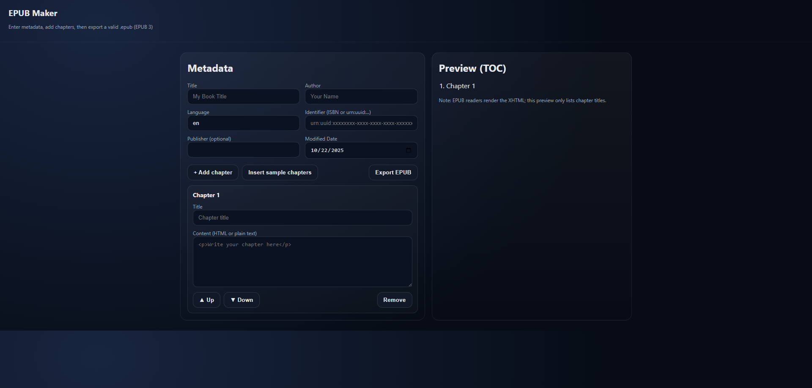

# EPUB Maker

Create a valid **EPUB 3** file right in your browser and download it — no build step required.
This app serves a single-page UI and an `/export` API that assembles an EPUB on the fly.



## ✨ Features

- Fill in book metadata (title, author, language, identifier, publisher, date)
- Add, remove, and reorder chapters with rich text (HTML allowed)
- Instant EPUB generation via streaming ZIP (no temp files)
- Standards-conscious: correct `mimetype` position, `META-INF/container.xml`, `OEBPS/content.opf`, `OEBPS/nav.xhtml`
- Works offline once loaded

## 📦 Tech

- **Node.js** (Express) for the server and `/export` endpoint
- **yazl** to stream a valid `.epub` (ZIP) to the browser
- **UUID** for identifiers when not provided
- Optional: Tailwind CSS (v4) is included as a dependency but the UI ships as plain HTML/CSS

> Minimum Node.js: **18+**. Developed with ESM (`"type": "module"`).

## 🚀 Quick start

```bash
git clone https://github.com/YOUR-USER/epub-maker.git
cd epub-maker
npm install
npm run dev
# open http://localhost:3000
```

- Dev mode uses `nodemon` to reload on changes.
- To run without auto-reload: `npm start`.

## 🖥️ Using the UI

1. Open http://localhost:3000
2. Fill out **Book Metadata**
3. Add chapters (give each a title and paste content; plain text becomes paragraphs; basic inline HTML is allowed)
4. Click **Export EPUB** — your browser downloads `{title}.epub`

## 🔌 API

`POST /export`

**Request body** (JSON):

```json
{
  "metadata": {
    "title": "My Book",
    "author": "Jane Smith",
    "language": "en",
    "identifier": "urn:uuid:...",
    "publisher": "Self",
    "date": "2025-10-22"
  },
  "chapters": [
    {"title": "Chapter 1", "contentHtml": "<p>Hello world</p>"}
  ]
}
```

- `metadata.title` and at least **one chapter** are required.
- If `identifier` is omitted, a UUID URN is generated.
- If `contentHtml` is plain text, the server wraps paragraphs automatically.

**Response**: `200 OK` with `Content-Type: application/epub+zip` (the EPUB file).

### cURL example

```bash
curl -X POST http://localhost:3000/export \
  -H "Content-Type: application/json" \
  -o my-book.epub \
  -d '{"metadata":{"title":"My Book","author":"Jane"}, "chapters":[{"title":"One","contentHtml":"<p>Hi!</p>"}]}'
```

## 🗂️ Project layout

```
epub-maker/
├─ public/
│  └─ index.html        # Single-page UI
├─ server.js            # Express server and EPUB assembly
├─ package.json
├─ .gitignore
├─ README.md
└─ LICENSE
```

## 🧪 Validation

Generated files follow EPUB conventions:
- First entry `mimetype` (stored, uncompressed)
- `META-INF/container.xml` pointing at `OEBPS/content.opf`
- `OEBPS/nav.xhtml` with links to chapter files
- XHTML files for each chapter (`OEBPS/chapter-*.xhtml`)

You can validate with [epubcheck](https://github.com/w3c/epubcheck).

## 🛠 Development notes

- The UI is intentionally framework-free and loads instantly.
- Tailwind v4 is included but not required; feel free to integrate a build step if desired.
- If you add images, you'll need to extend `content.opf` and the manifest list in `server.js`.

## 📄 License

MIT — see [LICENSE](./LICENSE).

## 🤝 Contributing

See [CONTRIBUTING.md](./CONTRIBUTING.md) and our [Code of Conduct](./CODE_OF_CONDUCT.md).
